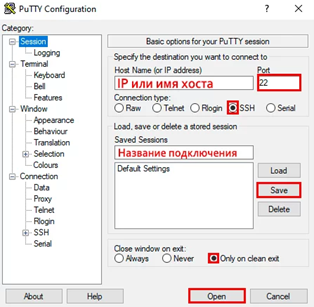

# Подключение к серверу по протоколу SSH

Средства используемые для подключения к серверу зависит от типа операционной системы (ОС) ПК, используемой на рабочем месте оператора.


## Подключение через Windows

Для подключения по протоколу SSH через ОС Windows рекомендуется использовать клиент PuTTY. Эта программа распространяется бесплатно, не требует установки и состоит из одного исполняемого файла. Выполните следующие действия для установления соединения с сервером:

1. Скачайте PuTTY с официального сайта <https://www.putty.org/>  
2. Запустите файл putty.exe  
3. Введите IP—адрес сервера 192.0.2.1 в поле Host Name (or IP address). Проверьте значение в поле Port и убедитесь, что номер порта равен 22. Также убедитесь, что в поле Connection type установлено значение SSH. В поле Saved Sessions введите имя сессии латинскими буквами и нажмите кнопку Save. Установите в поле Close window on exit значение only on clean exit.  
4. Нажмите кнопку Open для запуска сессии соединения.
 
<figure style="display: grid; place-items: center;" class = "photo_content">
  
  <figcaption>Окно программы PuTTY  
</figcaption>
</figure>


5. Может появиться сообщение о безопасности, нажмите кнопку Yes для установки соединения.

6. Откроется терминал с полем ввода
 
```bash
login:
```
куда необходимо ввести логин admin.

7. Введите пароль администратора в командную строку (пароль администратора выдается после ввода сервера в эксплуатацию, рекомендуется сменить пароль сразу после первого входа на сервер) и нажмите клавишу Enter. Обратите внимание, что в целях безопасности пароль не отображается во время набора символов.
Примечание: Пароль необходимо вводить каждый раз при подключении. Если вы подключаетесь к серверу в первый раз, то увидите сообщение от fingerprint. Чтобы войти на сервер, необходимо ввести yes.

```bash
login: admin
admin@192.0.2.1's password:
```

После ввода пароля вы получите доступ к BMC.

Вы можете использовать символ “?” для отображения доступных команд.
```bash
login: admin
admin@192.0.2.1's password:
Enter '?' to view avaliable commands.
_bmc>
```

## Подключение через Linux

Протокол SSH чаще всего по умолчанию поддерживается операционной системой Linux. В случае отсутствия обратитесь к документации своей операционной системы для установки SSH клиента.

Откройте терминал для установления подключения с сервером. К примеру, в ОС Ubuntu вы можете использовать сочетание клавиш “Ctrl+Alt+T” или поисковую строку в главном меню.
1.	Введите следующую команду:
```bash
 ssh admin@192.0.2.1
 ```
где: ssh — доступ на сервер через протокол SSH; admin — логин на сервер; 192.0.2.1 — адрес сервера.
2.	Введите пароль администратора (пароль администратора выдается после ввода сервера в эксплуатацию, рекомендуется сменить пароль сразу после первого входа на сервер) и нажмите клавишу Enter. Обратите внимание, что в целях безопасности пароль не отображается во время набора символов.


Примечание: Пароль необходимо вводить каждый раз при подключении. Если вы подключаетесь к серверу в первый раз, то увидите сообщение от fingerprint. Чтобы войти на сервер, необходимо ввести yes.


После ввода пароля вы получите доступ на BMC
