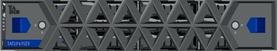
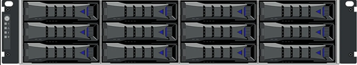
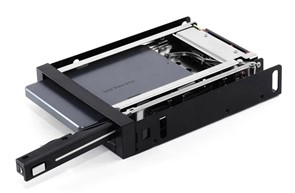

# Замена дискового накопителя
Внимание: при работе рекомендуется использовать антистатический браслет!
## Выполните следующие шаги для извлечения дискового накопителя:
1.	Откройте дверцу телекоммуникационного шкафа.
2.	Сдвиньте фиксаторы слева и справа на крышке дискового модуля расширения.

<figure class = "photo_content">
  
  <figcaption>Дисковый модуль расширения с крышкой модуля</figcaption>
</figure>

3.	Потяните на себя и снимите переднюю крышку дискового модуля расширения.

<figure class = "photo_content">
  
  <figcaption>Дисковый модуль расширения со снятой крышкой модуля</figcaption>

</figure>

4.	Нажмите на фиксатор и аккуратно выдвиньте лоток дискового накопителя. 

<figure class = "photo_content">
  
<figcaption>Лоток дискового накопителя</figcaption>
</figure>

5.	Извлеките дисковый накопитель из пазов лотка дискового накопителя.

## Выполните следующие шаги для установки нового дискового накопителя:
1.	Установите новый дисковый накопитель в пазы лотка накопителя.
2.	Верните лоток с дисковым накопителем в корпус дискового модуля расширения.
3.	Проверьте индикацию на лотке накопителя, индикатор должен подсвечиваться зеленым цветом.
4.	Установите переднюю крышку дискового модуля расширения.
5.	Убедитесь, что фиксаторы слева и справа на крышке дискового модуля расширения вернулись на свои места.
6.	Закройте дверцу телекоммуникационного шкафа.
