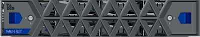
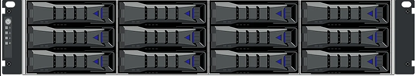
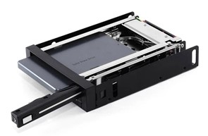

# Как заменить диск в телекоммуникационном шкафу Yadro



 Перед началом наденьте антистатический браслет, чтобы защитить чувствительные компоненты. Без него легко спалить электронику.



## Извлеките старый диск

1. Откройте дверцу шкафа.
2. Снимите защитную крышку модуля: сдвиньте синие фиксаторы крышки с обеих сторон.

<figure class = "photo_content">
  
  <figcaption>Дисковый модуль с крышкой</figcaption>
</figure>

3. Потяните на себя крышку до полного отсоединения.

<figure class = "photo_content">
  
  <figcaption>Дисковый модуль без крышки</figcaption>
</figure>

4. **Извлеките лоток с диском:**

    1. Нажмите на фиксатор лотка.  
    2. Аккуратно выдвиньте лоток, держась за боковые ручки.

<figure class = "photo_content">
  
  <figcaption>Лоток дискового накопителя</figcaption>
</figure>

5. Демонтируйте старый диск.

Чтобы вытащить диск, отожмите боковые крепления и аккуратно выньте его из лотка.

## Установите новый диск

1. Закрепите диск в лотке.

Совместите направляющие диска с пазами лотка и вставьте до щелчка.

2. **Верните лоток в модуль:**

   1. Аккуратно вдвиньте лоток обратно в слот до упора.  
   2. Дождитесь щелчка фиксатора.

     
   

    Если горит зелёный свет индикатора — диск распознан. Если красный или жёлтый — проверьте плотность подключения.

    

3. **Соберите модуль обратно:**

   1. Установите переднюю крышку на место.  
   2. Защелкните левый и правый фиксаторы.

4. Закройте шкаф.

Убедитесь, что дверца плотно прилегает и зафиксирована.